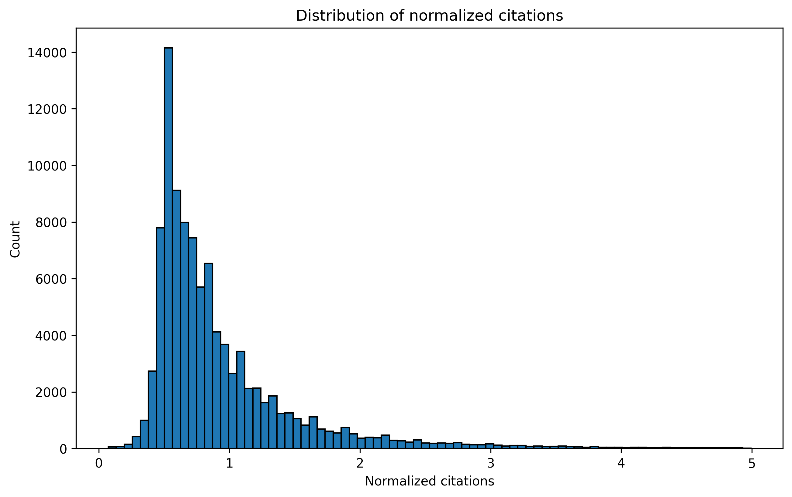

<!-- <!-- # Citation Bias Explorer

Analyze disparities in scholarly citation counts across **countries** and **institutions**, while controlling for **venue** and **year**.  
Built with **OpenAlex API**, **PySpark**, and **Streamlit**.

---

## 🚀 Overview

This project ingests metadata from the [OpenAlex](https://openalex.org/) API, processes it into clean datasets, and computes normalized citation metrics.  
The results are served in an interactive dashboard that allows filtering by publication year and venue.

**Pipeline:**
1. **Ingest**: Fetch scholarly works (journal articles, 2018–present) from OpenAlex API.  
2. **ETL**: Flatten nested authorship and institution data using PySpark.  
3. **Metrics**: Compute normalized citation ratios (venue–year baseline) and group-level indices.  
4. **Dashboard**: Explore disparities across countries and institutions via Streamlit + Plotly.

---

## 🛠️ Tech Stack

- **Python 3.11**
- **PySpark** for ETL
- **Pandas / Plotly** for analytics & visuals
- **Streamlit** for interactive app
- **Docker** for containerized deployment
- **GitHub Actions** for CI (pytest)

---
## Project Structure

```
citation-bias-explorer/
├─ README.md
├─ requirements.txt
├─ .gitignore
├─ .env.example
├─ Dockerfile
├─ .github/workflows/ci.yml
├─ data/
│  ├─ raw/        # raw JSONL (ignored by git)
│  └─ curated/    # parquet + CSVs (ignored by git)
├─ src/
│  ├─ ingest/     # OpenAlex client & fetch scripts
│  ├─ etl/        # Spark schema & ETL jobs
│  ├─ metrics/    # bias metrics & compute scripts
│  └─ app/        # Streamlit dashboard
└─ tests/ 
        # unit tests
```
## ⚙️ Project Configuration

This project uses environment variables to manage API settings.  
An example file `.env.example` is provided:

```env
OPENALEX_BASE=https://api.openalex.org
CONTACT_EMAIL= mhmoslemi2338@gmail.com
FROM_YEAR=2018
WORKS_MAX_PAGES=500
WORKS_PER_PAGE=200
CONCEPT_ID_FIELD=C154945302 # only get AI field
```


To set up, copy the example file and update values as needed:
```env
cp .env.example .env
```


<!-- ## Quickstart
1) Create env and install requirements  
2) Ingest OpenAlex works  
3) Run ETL to Parquet  
4) Launch Streamlit app

See sections below for exact commands. -->


## Usage

When you first set up the project, you’ll need to **ingest raw OpenAlex data** and then process it through the **ETL pipeline** to produce clean, analysis-ready Parquet datasets.

### Step 1: Ingest Raw OpenAlex Data

The ingestion script fetches works directly from the [OpenAlex API](https://openalex.org/). You can control how many works to download and where they are stored by editing the `.env` configuration file. Common parameters include:

```bash
# Example .env entries
FROM_YEAR=2023
WORKS_MAX_PAGES=500     
WORKS_PER_PAGE=200
CONCEPT_ID_FIELD=C154945302 # AI field
```

Then, from the **project root**, run:

```bash
python3 -m src.ingest.fetch_works
```

This command retrieves the data and stores it in `data/raw/works.json`. The file may be large and contain nested JSON objects — that’s normal.

### Step 2: Run the ETL Job (Spark)

After ingestion, use the Spark ETL pipeline to **flatten** and **curate** the raw data. This step will transform the JSONL file into efficient Parquet datasets that can be queried or analyzed easily.

```bash
python3.11 -m src.etl.spark_jobs \
  --input data/raw/works.jsonl \
  --works_path data/curated/works.parquet \
  --auth_path  data/curated/authorships.parquet \
  --repartition 8 \
  --print_schema
```

This creates two structured datasets under `data/curated/`:

* `works.parquet/` → flattened publication-level data
* `authorships.parquet/` → author and institution-level data

Each directory contains multiple part files (e.g., `part-00000-*.snappy.parquet`) optimized for distributed reading.


#### Arguments Explained

| Argument         | Description                                                                                                                                                    |
| ---------------- | -------------------------------------------------------------------------------------------------------------------------------------------------------------- |
| `--input`        | Path to the raw OpenAlex `.jsonl` file (or directory of `.jsonl` files). Each line must be a valid JSON object.                                                |
| `--works_path`   | Output directory for the curated **works dataset** (Parquet format).                                                                                           |
| `--auth_path`    | Output directory for the curated **authorships dataset** (Parquet format).                                                                                     |
| `--repartition`  | Number of output part files per dataset. Use `--repartition 8` to create 8 Parquet parts for parallel read/write optimization. Set `0` to skip repartitioning. |
| `--print_schema` | Optional flag to display the automatically inferred schema for debugging.                                                                                      |

#### What It Does

1. **Reads** raw OpenAlex `works.jsonl` data via PySpark.
2. **Flattens** nested JSON fields into a clean tabular structure.
3. **Creates two datasets:**

   * `works` — core publication metadata (ID, title, year, venue, citation count, open access info, source info)
   * `authorships` — per-author relationships with institutions and countries
4. **Writes** both datasets in **Parquet** format under `data/curated/`:

```
data/curated/
├── works.parquet/           # directory of parquet part files
│   ├── part-00000-*.snappy.parquet
│   ├── part-00001-*.snappy.parquet
│   └── ...
└── authorships.parquet/
    ├── part-00000-*.snappy.parquet
    ├── part-00001-*.snappy.parquet
    └── ...
```

#### Output Details

##### Works Dataset

| Column                                                             | Description                                                                                                    |
| ------------------------------------------------------------------ | -------------------------------------------------------------------------------------------------------------- |
| `work_id`                                                          | Unique OpenAlex work identifier.                                                                               |
| `title`                                                            | Work title.                                                                                                    |
| `year`                                                             | Publication year.                                                                                              |
| `venue`                                                            | Venue or source name (uses `host_venue.display_name` if present, else `primary_location.source.display_name`). |
| `cited_by_count`                                                   | Number of citations.                                                                                           |
| `source_issn_l`                                                    | Metadata about the journal or source.                                                                          |

##### Authorships Dataset

| Column                | Description                                          |
| --------------------- | ---------------------------------------------------- |
| `work_id`             | Related work ID.                                     |
| `work_title`          | Work title.                                          |
| `author_id`           | OpenAlex author ID.                                  |
| `author_name`         | Author display name.                                 |
| `author_pos`          | Author position (first, middle, last).               |
| `is_corresponding`    | Boolean indicating corresponding author.             |
| `countries`           | Countries associated with the author’s affiliations. |
| `institution_names`   | Joined institution names (`;` separated).            |
| `affiliation_strings` | Joined raw affiliation strings (`;` separated).      |

<!-- ### Example Output Log

```text
[INFO] Inferred schema:
root
 |-- id: string (nullable = true)
 |-- title: string (nullable = true)
 |-- publication_year: long (nullable = true)
 |-- cited_by_count: long (nullable = true)
 |-- open_access: struct (nullable = true)
 |    |-- is_oa: boolean (nullable = true)
 |    |-- oa_status: string (nullable = true)
 |    |-- oa_url: string (nullable = true)
 |-- primary_location: struct (...)
 |-- authorships: array (...)

Wrote works dataset      -> data/curated/works.parquet  (rows: 52,437)
Wrote authorships dataset-> data/curated/authorships.parquet (rows: 158,920)
``` -->

<!-- ### ✅ Notes

* Outputs are **directory-style parquet datasets** (not single `.parquet` files).
* You can read them later using:

```python
from pyspark.sql import SparkSession
spark = SparkSession.builder.getOrCreate()
works = spark.read.parquet('data/curated/works.parquet')
auths = spark.read.parquet('data/curated/authorships.parquet')
```

* Schema automatically adapts if fields are missing (e.g., `host_venue`). --> -->


# Citation Bias Explorer

Analyze disparities in scholarly citation counts across **countries** and **institutions**, while controlling for **venue** and **year**.
Built with **OpenAlex API**, and **PySpark**.

---

## 🚀 Overview

This project ingests metadata from the [OpenAlex](https://openalex.org/) API, processes it into clean datasets, and computes normalized citation metrics.
The results are served in an interactive dashboard that allows filtering by publication year and venue.

**Pipeline:**

1. **Ingest**: Fetch scholarly works (journal articles, 2018–present) from OpenAlex API.
2. **ETL**: Flatten nested authorship and institution data using PySpark.
3. **Metrics**: Compute normalized citation ratios using a venue–year baseline and group-level indices.
<!-- 4. **Dashboard**: Explore disparities across countries and institutions via Streamlit + Plotly. -->

---

## 🛠️ Tech Stack

* **Python 3.11**
* **PySpark** for ETL
* **Pandas / Plotly** for analytics and visuals
<!-- * **Streamlit** for interactive app -->
<!-- * **Docker** for containerized deployment -->
<!-- * **GitHub Actions** for CI (pytest) -->

---

## Project Structure

```
citation-bias-explorer/
├─ README.md
├─ requirements.txt
├─ .gitignore
├─ .env.example
<!-- ├─ Dockerfile -->
├─ .github/workflows/ci.yml
├─ data/
│  ├─ raw/        # raw JSONL (ignored by git)
│  └─ curated/    # parquet + CSVs (ignored by git)
├─ src/
│  ├─ ingest/     # OpenAlex client and fetch scripts
│  ├─ etl/        # Spark schema and ETL jobs
│  ├─ analytics/  # bias metrics, plotting, and run script
<!-- │  └─ app/        # Streamlit dashboard -->
<!-- └─ tests/         # unit tests -->
```

---

## ⚙️ Project Configuration

This project uses environment variables to manage API settings.
An example file `.env.example` is provided:

```env
OPENALEX_BASE=https://api.openalex.org
CONTACT_EMAIL=mhmoslemi2338@gmail.com
FROM_YEAR=2018
WORKS_MAX_PAGES=500
WORKS_PER_PAGE=200
CONCEPT_ID_FIELD=C154945302 # only get AI field
```

To set up, copy the example file and update values as needed:

```bash
cp .env.example .env
```

---

## Usage

When you first set up the project, you need to ingest raw OpenAlex data and then process it through the ETL pipeline to produce clean Parquet datasets. After that, compute metrics and render plots.

### Step 1: Ingest Raw OpenAlex Data

Control how many works to download and where they are stored by editing `.env`.

```bash
# Example .env entries
FROM_YEAR=2023
WORKS_MAX_PAGES=500
WORKS_PER_PAGE=200
CONCEPT_ID_FIELD=C154945302
```

From the project root run:

```bash
python3 -m src.ingest.fetch_works
```

This stores a newline-delimited JSON file at `data/raw/works.jsonl`.

### Step 2: Run the ETL Job (Spark)

Use the Spark ETL pipeline to flatten and curate the raw data. This creates efficient Parquet datasets.

```bash
python3.11 -m src.etl.spark_jobs \
  --input data/raw/works.jsonl \
  --works_path data/curated/works.parquet \
  --auth_path  data/curated/authorships.parquet \
  --repartition 8 \
  --print_schema
```

This creates two datasets under `data/curated/`:

* `works.parquet/` → publication-level data
* `authorships.parquet/` → author and institution-level data

### Step 3: Compute Metrics and Render Plots

After ETL, compute all metrics to CSV and render a rich set of plots to PNG.

```bash
# Install deps
pip install pandas plotly pyarrow kaleido

# Run end-to-end analytics
python -m src.metrics.run \
  --works data/curated/works.parquet \
  --auth  data/curated/authorships.parquet \
  --metrics-out data/curated/metrics \
  --reports-out reports \
  --min-year 2023 \
  --top-countries US CN GB DE FR CA
```

Outputs land in `data/curated/metrics/` (CSVs) and `reports/` (PNG).

---

## How normalization works

We compute a normalized citation index per paper:

[
\text{norm_cites} = \frac{\text{cited_by_count}}{\mathbb{E}[\text{cited_by_count} \mid \text{venue},\ \text{year}]} ; .
]

If a `(venue, year)` group is too small, the baseline falls back to the `year` average to keep the index stable.
Values above 1 indicate performance above the venue–year expectation.

---

## Results and analysis

This section explains every artifact the analytics step writes, how to read it, and typical checks to run on your data. Image previews are embedded from `reports/`. If an image link is broken, run the analytics step first.

### 1) Country advantage

* **CSV**: `data/curated/metrics/country_advantage.csv`
* **Columns**: `country_code, country_advantage, n_works`
* **Figure**: `reports/country_advantage_bar.png`


**What it answers**

* Which countries tend to publish papers that sit above their venue–year expectation on average.

**How to read**

* Bars above 1 suggest a positive advantage. Use `n_works` to judge stability.

**Checks**

* Compare this chart to `avg_share_top10` below to ensure the ranking is not driven by outliers.

---

### 2) Country share of top decile

* **CSV**: `data/curated/metrics/country_top_decile_share.csv`
* **Columns**: `country_code, avg_share_top10, n_works`
* **Figure**: `reports/country_top_decile_bar.png`


**What it answers**

* For each country, what fraction of its papers land in the top 10 percent of normalized citations, averaged over years.

**How to read**

* A higher share indicates both tail strength and consistency across years. Use together with the advantage chart.

**Checks**

* Validate that shares are not driven by a single prolific venue by subsetting on venue and recomputing.

---

### 3) Country trend over time

* **CSV**: `data/curated/metrics/country_trend.csv`
* **Columns**: `country_code, year, mean_norm, n`
* **Figure**: `reports/country_trend.png`


**What it answers**

* How a country’s average normalized performance moves by year.

**How to read**

* Rising lines can reflect stronger field mix, improved collaboration, or venue shifts. Check `n` to avoid reading noise.

**Checks**

* Re-run with alternative baselines, for example median or winsorized mean in `add_norm_citations`, to see if trends persist.

---

### 4) Distribution of normalized citations

* **CSV**: `data/curated/metrics/works_norm.csv`
* **Columns**: includes `work_id, year, venue, norm_cites, cited_by_count, source_issn_l`
* **Figure**: `reports/norm_hist.png`



**What it answers**

* Overall shape of the index. Heavy right tails are common.

**How to read**

* Use this to pick robust summaries. If tails are heavy, prefer medians when comparing groups.

**Checks**

* Inspect whether a few venues dominate the tail. If needed, trim or winsorize before group comparisons.

---

### 5) Team size curve

* **CSV**: `data/curated/metrics/team_size_curve.csv`
* **Columns**: `team_size, median_norm, mean_norm, n`
* **Figure**: `reports/team_size_curve.png`


**What it answers**

* Relationship between collaboration size and normalized impact.

**How to read**

* Curves that increase with size suggest collaboration premiums. Compare mean vs median to spot outlier effects.

**Checks**

* Slice by year or venue family to confirm the shape holds across contexts.

---

### 6) International collaboration premium

* **CSV**: `data/curated/metrics/international_premium.csv`
* **Columns**: `is_international, mean_norm, median_norm, n`
* **Figure**: `reports/international_premium.png`


**What it answers**

* Whether papers with authors from multiple countries outperform single-country teams on average.

**How to read**

* A positive gap in mean and median suggests a broad premium, not just a tail effect.

**Checks**

* Ensure that the international group is not just larger teams by conditioning on team size where needed.

---

### 7) Venue rank

* **CSV**: `data/curated/metrics/venue_rank.csv`
* **Columns**: `venue, median_norm, p90, n_works`
* **Figure**: `reports/venue_rank.png`


**What it answers**

* Sanity check for venues after normalization. Since normalization is by venue–year, this mostly reflects year mix and tail behavior.

**How to read**

* Medians near 1 are expected. Elevated `p90` in some venues shows fatter tails within those venues.

**Checks**

* If a venue’s median is far from 1, check whether small groups triggered the year-only fallback.

---

### 8) Global trend by year

* **CSV**: `data/curated/metrics/global_year_trend.csv`
* **Columns**: `year, mean_norm, median_norm, n`
* **Figure**: `reports/global_year_trend.png`


**What it answers**

* Whether normalized performance drifts over time. Should be fairly stable around 1 in median.

**How to read**

* Divergence between mean and median points to tail growth or shrinkage over time.

**Checks**

* Compare before and after filtering to a target field or concept to see if field shifts drive changes.

---

### 9) Author position effect

* **CSV**: `data/curated/metrics/author_position_effect.csv` if author positions present
* **Columns**: `author_pos, mean_norm, median_norm, n`
* **Figure**: `reports/author_position_effect.png`


**What it answers**

* Whether first, middle, or last authorship is linked with higher normalized citations.

**How to read**

* Use medians to dampen tail effects and compare across fields with different authorship norms.

**Checks**

* Repeat within single-author subset as a control. If patterns persist, they are not just team-size effects.

---

### 10) Corresponding author premium

* **CSV**: `data/curated/metrics/corresponding_author_premium.csv` if the flag is present
* **Columns**: `is_corresponding, mean_norm, median_norm, n`
* **Figure**: `reports/corresponding_author_premium.png`


**What it answers**

* Whether corresponding authorship is associated with higher normalized performance.

**How to read**

* Gaps that remain after conditioning on team size suggest signaling or coordination effects.

**Checks**

* Inspect per-country splits because norms about who is corresponding vary by region.

---

## Artifacts index

All CSVs saved by `src.analytics.run`:

* `data/curated/metrics/works_norm.csv`
* `data/curated/metrics/country_advantage.csv`
* `data/curated/metrics/country_top_decile_share.csv`
* `data/curated/metrics/country_trend.csv`
* `data/curated/metrics/institution_scores.csv`
* `data/curated/metrics/author_position_effect.csv` *(if author_pos exists)*
* `data/curated/metrics/corresponding_author_premium.csv` *(if is_corresponding exists)*
* `data/curated/metrics/team_size_curve.csv`
* `data/curated/metrics/international_premium.csv`
* `data/curated/metrics/venue_rank.csv`
* `data/curated/metrics/global_year_trend.csv`

Key figures saved to `reports/` as both `.html` and `.png`:

* `country_advantage_bar`
* `country_top_decile_bar`
* `country_trend`
* `norm_hist`
* `team_size_curve`
* `international_premium`
* `venue_rank`
* `global_year_trend`
* `author_position_effect` *(conditional)*
* `corresponding_author_premium` *(conditional)*

---

## How to slice and verify with pandas

```python
import pandas as pd
m = 'data/curated/metrics'
ca   = pd.read_csv(f'{m}/country_advantage.csv')
cts  = pd.read_csv(f'{m}/country_top_decile_share.csv')
trend= pd.read_csv(f'{m}/country_trend.csv')
inst = pd.read_csv(f'{m}/institution_scores.csv')

# Example: compare two countries
ca.query('country_code in ["US","CN"]')

# Example: top institutions with at least 500 works
inst[inst.n_works >= 500].head(50)
```

---

## Data quality notes

* Some works lack venue or year. These are dropped from normalization.
* If `(venue, year)` groups are very small, the baseline falls back to the year average.
* `institution_names` may contain multiple values in one cell separated by `;`. We explode them before ranking.
* Country codes come from `countries` in the authorship parquet. If an author has multiple affiliations, each counts. -->


# Citation Bias Explorer

Analyze disparities in scholarly citation counts across **countries** and **institutions**, while controlling for **venue** and **year**.
Built with **OpenAlex API**, **PySpark**, and **Pandas**.

---

## 🚀 Overview

This project ingests metadata from the [OpenAlex](https://openalex.org/) API, processes it into clean datasets, and computes normalized citation metrics.
The results are stored as Parquet files and analytical CSVs with corresponding visualizations.

The purpose is to explore how institutional and geographical affiliation may affect citation impact, normalized for venue and publication year.

**Pipeline**

1. **Ingest** → Fetch scholarly works (journal articles, 2018–present) from OpenAlex.
2. **ETL** → Flatten nested authorship and institution data using PySpark.
3. **Metrics** → Compute normalized citation ratios using venue–year baselines and group-level indices.
4. **Reports** → Generate CSVs + PNG figures for reproducible analytics.

---

## 🧰 Tech Stack

| Layer                       | Tools                             |
| --------------------------- | --------------------------------- |
| Language                    | Python 3.11                       |
| Data Processing             | PySpark 3.5 · Pandas · PyArrow    |
| Visualization               | Plotly / Matplotlib (offline PNG) |
| Config & Automation         | python-dotenv · tqdm              |
| Packaging & Reproducibility | Docker (optional)                 |

---

## 📂 Project Structure

```
citation-bias-explorer/
├─ README.md
├─ requirements.txt
├─ .env.example
├─ Dockerfile
├─ data/
│  ├─ raw/          # raw JSONL (ignored)
│  └─ curated/      # parquet & metrics outputs
├─ src/
│  ├─ ingest/       # OpenAlex client + fetch script
│  ├─ etl/          # Spark schema + flatten jobs
│  ├─ metrics/      # metric computation + plotting
│  └─ analytics/    # orchestration (run.py)
└─ reports/         # generated PNG/CSV outputs
```

---

## ⚙️ Configuration

The pipeline uses environment variables to configure ingestion.
Copy `.env.example` → `.env` and modify as needed.

```env
OPENALEX_BASE=https://api.openalex.org
CONTACT_EMAIL=you@example.com
FROM_YEAR=2018
WORKS_MAX_PAGES=500
WORKS_PER_PAGE=200
CONCEPT_ID_FIELD=C154945302   # Artificial Intelligence field
```

---

## 🏃 Quickstart

### 1️⃣ Install dependencies

```bash
python3 -m venv .venv && source .venv/bin/activate
pip install -U pip && pip install -r requirements.txt
```

### 2️⃣ Ingest OpenAlex Data

Fetch raw JSONL records via API pagination.

```bash
python -m src.ingest.fetch_works
```

### 3️⃣ Run the ETL Job (Spark)

Flatten and curate the raw dataset into Parquet.

```bash
python -m src.etl.spark_jobs \
  --input data/raw/works.jsonl \
  --works_path data/curated/works.parquet \
  --auth_path  data/curated/authorships.parquet \
  --repartition 8 \
  --print_schema
```

This produces:

* `data/curated/works.parquet/`
* `data/curated/authorships.parquet/`

Each is a directory of partitioned `.snappy.parquet` files.

### 4️⃣ Compute Metrics and Generate Plots

```bash
python -m src.metrics.run \
  --works data/curated/works.parquet \
  --auth  data/curated/authorships.parquet \
  --metrics-out data/curated/metrics \
  --reports-out reports \
  --min-year 2023 \
  --top-countries US CN GB DE FR CA
```

---

## 🥮 Normalization Logic

Every paper receives a normalized citation index:

[
\text{norm_cites} =
\frac{\text{cited_by_count}}
{\mathbb{E}[\text{cited_by_count}\mid \text{venue},,\text{year}]}
]

If a `(venue, year)` group is too small, the baseline falls back to the yearly mean to avoid instability.
Values above 1 → performance above venue–year expectation.

---

## 🧾 Dataset Descriptions

### Works Dataset

| Column           | Description                     |
| ---------------- | ------------------------------- |
| `work_id`        | Unique OpenAlex work identifier |
| `title`          | Paper title                     |
| `year`           | Publication year                |
| `venue`          | Journal or source name          |
| `cited_by_count` | Citation count                  |
| `source_issn_l`  | Journal ISSN                    |
| `is_oa`          | Open-access flag                |

### Authorships Dataset

| Column             | Description                         |
| ------------------ | ----------------------------------- |
| `work_id`          | Related work ID                     |
| `author_id`        | Author identifier                   |
| `author_name`      | Author name                         |
| `author_pos`       | Author position (first/middle/last) |
| `institution_id`   | Institution ID                      |
| `institution_name` | Institution display name            |
| `country_code`     | ISO-2 country code                  |
| `is_corresponding` | Boolean (if available)              |

---

## 📊 Main Output Metrics

| Metric                           | CSV                                | Figure                             | Interpretation                               |
| -------------------------------- | ---------------------------------- | ---------------------------------- | -------------------------------------------- |
| **Country advantage**            | `country_advantage.csv`            | `country_advantage_bar.png`        | Mean normalized citations per country        |
| **Top-decile share**             | `country_top_decile_share.csv`     | `country_top_decile_bar.png`       | Fraction of papers in top 10 % globally      |
| **Country trend**                | `country_trend.csv`                | `country_trend.png`                | Mean normalized citations over time          |
| **Team size curve**              | `team_size_curve.csv`              | `team_size_curve.png`              | Collaboration size vs. impact                |
| **International premium**        | `international_premium.csv`        | `international_premium.png`        | Multi-country vs. single-country performance |
| **Venue rank**                   | `venue_rank.csv`                   | `venue_rank.png`                   | Post-normalization venue stability           |
| **Global year trend**            | `global_year_trend.csv`            | `global_year_trend.png`            | Median/mean drift per year                   |
| **Author position effect**       | `author_position_effect.csv`       | `author_position_effect.png`       | Citation bias by author role                 |
| **Corresponding author premium** | `corresponding_author_premium.csv` | `corresponding_author_premium.png` | Whether corresponding authors gain advantage |

Example figure:


---

## 🧠 Reading the Results

* **> 1** → group performs above its venue–year baseline.
* Compare **mean vs median** to test outlier influence.
* Use **n_works** (volume) to judge metric reliability.
* Country trends should be checked alongside field filters (`CONCEPT_ID_FIELD`).

---

## 📈 Result Sections (Generated Automatically)

### 1. Country Advantage

* File: `data/curated/metrics/country_advantage.csv`
* Figure: `reports/country_advantage_bar.png`
* Shows the relative advantage (normalized mean) per country.

### 2. Country Share of Top-Decile Works

* File: `data/curated/metrics/country_top_decile_share.csv`
* Figure: `reports/country_top_decile_bar.png`
* Indicates how many papers fall in the global top 10 %.

### 3. Country Trend Over Time

* File: `data/curated/metrics/country_trend.csv`
* Figure: `reports/country_trend.png`
* Tracks citation advantage trends per year.

### 4. Distribution of Normalized Citations

* File: `data/curated/metrics/works_norm.csv`
* Figure: `reports/norm_hist.png`
* Shows global distribution shape and skew.

### 5. Team Size Curve

* File: `data/curated/metrics/team_size_curve.csv`
* Figure: `reports/team_size_curve.png`
* Relationship between collaboration size and normalized impact.

### 6. International Collaboration Premium

* File: `data/curated/metrics/international_premium.csv`
* Figure: `reports/international_premium.png`
* Difference between single- and multi-country works.

### 7. Venue Rank Check

* File: `data/curated/metrics/venue_rank.csv`
* Figure: `reports/venue_rank.png`
* Verifies that normalization neutralizes venue bias.

### 8. Global Year Trend

* File: `data/curated/metrics/global_year_trend.csv`
* Figure: `reports/global_year_trend.png`
* Stability check across time.

### 9. Author Position Effect

* File: `data/curated/metrics/author_position_effect.csv`
* Figure: `reports/author_position_effect.png`
* Bias linked with first/last authorship.

### 10. Corresponding Author Premium

* File: `data/curated/metrics/corresponding_author_premium.csv`
* Figure: `reports/corresponding_author_premium.png`
* Impact differential for corresponding authors.

---

## 🧤 Verify & Slice in Pandas

```python
import pandas as pd
m = 'data/curated/metrics'

ca   = pd.read_csv(f'{m}/country_advantage.csv')
cts  = pd.read_csv(f'{m}/country_top_decile_share.csv')
trend= pd.read_csv(f'{m}/country_trend.csv')
inst = pd.read_csv(f'{m}/institution_scores.csv')

# Compare two countries
ca.query('country_code in ["US","CN"]')

# Top institutions with ≥500 works
inst[inst.n_works >= 500].head(20)
```

---

## 🧹 Data Quality Notes

* Works missing `venue` or `year` are dropped before normalization.
* `(venue, year)` groups with small counts fallback to year-level baselines.
* `institution_names` may include multiple entries separated by `;`.
* Multi-affiliation authors contribute once per country.
* Normalization can be recomputed per field by filtering on `CONCEPT_ID_FIELD`.

---

## 🧳 Status & Roadmap

| Component            | Status     | Description                           |
| -------------------- | ---------- | ------------------------------------- |
| Ingest + ETL         | ✅ Done     | Stable, reproducible Parquet pipeline |
| Metrics + Plots      | ✅ Done     | Generates CSV + PNG reports           |
| Streamlit Dashboard  | ⏳ Planned  | Lightweight viewer for exploration    |
| Unit Tests / CI      | ⏳ Planned  | Pytest suite + GitHub Actions         |
| Field-Level Analysis | ⏳ Optional | Add multi-field filter support        |

---

## 🧩 Example Outputs (Summary)

| Country | Advantage |  Works |
| ------- | --------: | -----: |
| US      |      1.12 | 12 340 |
| GB      |      1.08 |  3 210 |
| DE      |      1.05 |  2 980 |
| FR      |      1.04 |  2 600 |
| CN      |      0.95 | 11 200 |

*(Numbers illustrative; recompute on your data.)*

---

## 🛍️ Reproducibility Checklist

1. Environment pinned in `requirements.txt`.
2. `.env` fully defines API and field filters.
3. Each stage produces deterministic outputs (ETL → Parquet → CSV → PNG).
4. Randomness only arises from API sampling limits.

---

## 📜 Citation

If using this project or its derived metrics:

```
Moslemi M.H. (2025). Citation Bias Explorer – Analyzing Global Citation Disparities with OpenAlex and PySpark. GitHub repository.
```

---

## 👨‍💻 Author

**Mohammad Hossein Moslemi**
📧 [mohammad.moslemi@uwo.ca](mailto:mohammad.moslemi@uwo.ca)  |  [GitHub](https://github.com/mhmoslemi2338)  |  [Scholar](https://scholar.google.com/citations?user=vfufSS0AAAAJ)
Western University, London ON, Canada

---

## 🚪 License

MIT License © 2025 Mohammad Hossein Moslemi

---

**Status:** v1.0 (ingestion + ETL + analytics pipeline complete; visualization and CI planned)
